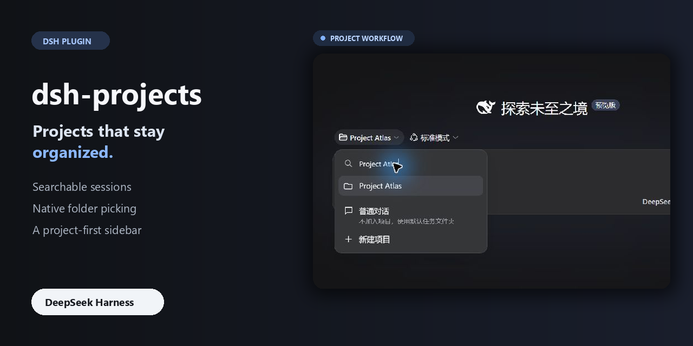
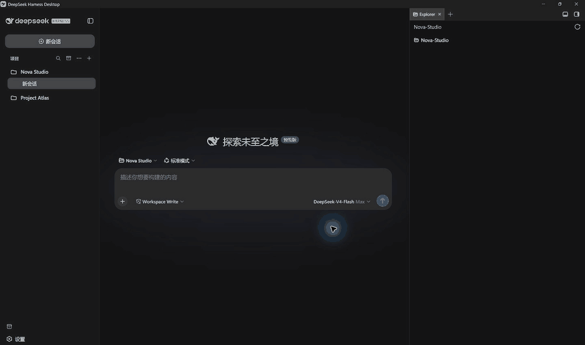
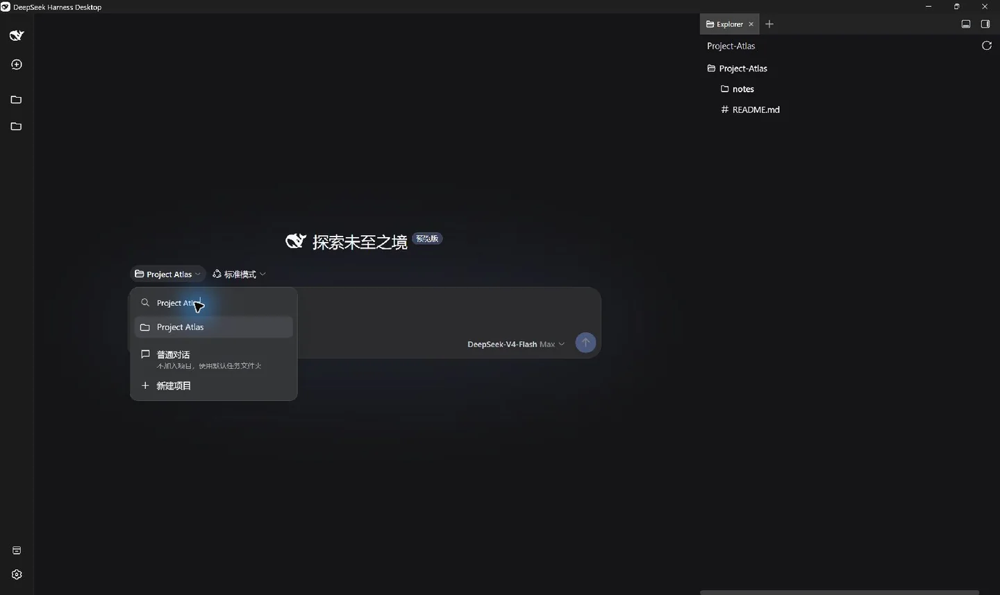
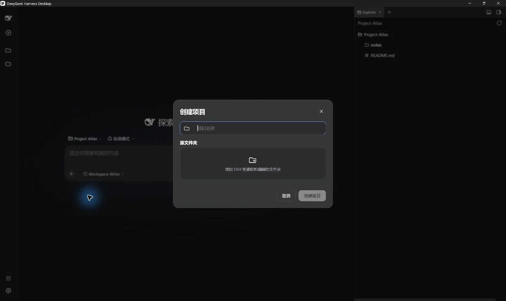
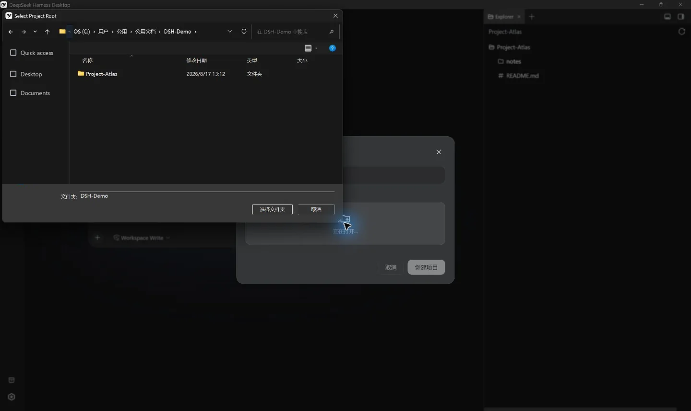

<p align="center">
  
</p>

<h1 align="center">dsh-projects</h1>

<p align="center"><strong>Turn scattered Workspaces and sessions into a clear, searchable project workflow.</strong></p>

<p align="center">
  English · <a href="README.md">简体中文</a><br>
  <a href="https://github.com/WenhongPan/dsh-projects/releases/latest"></a>
  <a href="https://github.com/WenhongPan/dsh-projects/actions/workflows/ci.yml"></a>
  <a href="LICENSE"></a>
</p>

<p align="center">
  <a href="#quick-install">Quick install</a> ·
  <a href="#at-a-glance">Feature tour</a> ·
  <a href="#compatibility">Compatibility</a> ·
  <a href="https://github.com/WenhongPan/dsh-projects/issues/new?template=bug.yml">Report a bug</a>
</p>



<sub>Full-screen, real interaction capture. The directory chooser is opened by the Windows native API; editing is limited to cropping, camera zoom, and GIF compression—no system UI was reconstructed.</sub>

DSH makes it easy to enter a Workspace, but folder selection and a flat session list become difficult to navigate as your work grows. `dsh-projects` adds a project layer over DSH's native Workspace and Session data: select and create projects, organize the sidebar, search chats, and inspect archived work without copying or migrating existing sessions.

### New in v0.3

- **Multi-folder projects:** group existing Workspaces and choose an explicit primary folder for new sessions.
- **Attention summaries:** use Off, Compact, or Expanded views for waiting, running, and completed sessions.
- **Better search:** group project, title, and chat-body matches directly under their projects with highlighted snippets.
- **Smarter folder picking:** remember the previous location or start from Desktop, Home, or the current project's parent.

Every advanced capability is opt-in. Without it, the plugin remains a lightweight organization layer over DSH data.

## At a glance

| Capability | What it gives you |
| --- | --- |
| Project entry | Search and switch projects above the composer, or start without choosing one |
| Project creation | Keep display names independent from folders and prefer the OS directory chooser locally |
| Sidebar | Group by project or use one list, with Recent, pinning, favorites, drag ordering, plus Off, Compact, or Expanded Session-status summaries |
| Management | Rename, open in the file manager, archive chats, and remove project registrations |
| Multi-folder projects | Optionally group existing Workspaces under one project without moving files or chats; dissolve the group at any time |
| Global search | Group results directly by project; optionally include chat bodies through DSH indexing |
| Archive center | Inspect archived chats; restore depends on a public DSH unarchive API |
| Theme and data | Follow DSH light/dark themes and keep using DSH's own Workspace and Session data |

<p>
  
  
</p>

## Quick install

The current version is `0.3.0-alpha.2`. The plugin accepts both the DSH `0.1.0-rc.6` line and `0.1.1-rc.2`. The latter has passed an isolated Web UI boot and core-surface check, and DSH Desktop 2.0.3's official Windows picker has passed a manual UI check. See the [compatibility matrix](docs/compatibility.md) for the remaining platform boundaries.

### DSH Desktop

```powershell
dsh plugin --profile desktop add https://github.com/WenhongPan/dsh-projects/releases/download/v0.3.0-alpha.2/dsh-projects-0.3.0-alpha.2.tgz
```

### DSH Web UI

```bash
dsh plugin --profile web add https://github.com/WenhongPan/dsh-projects/releases/download/v0.3.0-alpha.2/dsh-projects-0.3.0-alpha.2.tgz
```

Fully quit and restart the selected DSH profile after installation or upgrade. Desktop and Web are separate profiles and must be installed independently.

Source install is also available:

```bash
git clone https://github.com/WenhongPan/dsh-projects.git
cd dsh-projects
npm install
npm run verify
dsh plugin --profile desktop add link:/absolute/path/to/dsh-projects
```

On Windows, a link path can be written as `link:C:/path/to/dsh-projects`.

## Native folder picking

The plugin selects the best directory surface exposed by the current runtime, so regular users do not need to replace Desktop:

- DSH Desktop 2.0.3 and later use the official Desktop-owned Windows picker first.
- Older Desktop builds and local Web UI retain the plugin Host bridge, including remembered-parent and Desktop/Home start options.
- If neither bridge is available, the plugin calls DSH's stock Workspace picker.
- Remote Web UI uses the Host-side in-app browser and never asks the remote machine to show a system dialog.
- Cancellation is final and never opens a second chooser by mistake.

The patched Desktop installer in early Releases has been superseded by the official implementation. It remains as historical compatibility material and is no longer recommended for new installations. See [native picker options](docs/native-picker-options.md) for the exact fallback order.



## Chat without choosing a project

A regular chat receives an isolated task directory automatically:

```text
~/Documents/DSH-Default/YYYY-MM-DD/new-chat[-N]
```

Default tasks stay out of the Projects section but remain available in Recent. Each chat gets its own workspace instead of treating the whole Documents or home directory as writable.

## Compatibility

| Surface | Current status |
| --- | --- |
| DSH Desktop 2.0.1 / Windows x64 | ✅ Legacy bridge manually verified, including the native directory chooser |
| DSH Desktop 2.0.3 / Windows x64 | ✅ Plugin load, official picker, cancellation, and CJK/space path round-trip manually checked |
| DSH 0.1.1-rc.2 local Web UI / Windows | ✅ Isolated boot, plugin load, and core surfaces checked |
| DSH Desktop / macOS Apple Silicon | 🟡 CI passes; native picker and file-manager actions need manual coverage |
| Local Web UI / macOS and Linux | 🟡 CI passes; Host paths and local directory rules need manual coverage |
| Remote Web UI | ✅ Uses the Host-side in-app browser and never opens an OS dialog remotely |

See the full [compatibility matrix](docs/compatibility.md) and [architecture notes](docs/architecture.md). DeepSeek Harness is still a Developer Preview, so runtime upgrades may require compatibility work.

## Optional chat-body search

Project and chat-title search work by default. Chat-body search requires the DSH session index in the target profile's `cordis.patch.yml`:

```yaml
- id: session-query-sqlite
  config:
    path: !!js dshHomePath('session-search.sqlite')
    openAt: first-search
```

The index contains data derived from chat content and should receive the same privacy protection as the original sessions.

## Data and uninstalling

Basic mode does not create a second project database, and uninstalling the plugin does not delete folders or session logs. Grouping, ordering, pins, and favorites are browser-local preferences stored in `localStorage`. The optional multi-folder layer stores only its label, Workspace IDs, and primary Workspace ID there; it does not store chat bodies or move files. Clearing site data dissolves local groups without changing DSH Workspaces, Sessions, or project files.

## Development and feedback

```bash
npm install
npm run verify
npm pack --dry-run
```

This is an alpha. Use the structured forms to report a [bug](https://github.com/WenhongPan/dsh-projects/issues/new?template=bug.yml), share a [platform compatibility result](https://github.com/WenhongPan/dsh-projects/issues/new?template=compatibility.yml), or propose a [feature](https://github.com/WenhongPan/dsh-projects/issues/new?template=feature.yml). Remove private paths, prompts, and credentials before submitting.

See [CONTRIBUTING.md](CONTRIBUTING.md) for contribution guidance, [CHANGELOG.md](CHANGELOG.md) for release history, and the public [roadmap](docs/roadmap.md) for possible next steps.

If `dsh-projects` makes your Workspace or sidebar workflow easier, consider leaving a **Star**. It helps other DSH users discover the project, while real compatibility reports directly shape the next release.

## License

MIT
